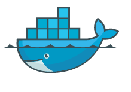

> 系统: centos7
>
> Docker从1.13版本之后采用时间线的方式作为版本号，分为社区版CE和企业版EE。
>
> 社区版是免费提供给个人开发者和小型团体使用的，企业版会提供额外的收费服务，比如经过官方测试认证过的基础设施、容器、插件等。
>
> 社区版按照stable和edge两种方式发布，每个季度更新stable版本，如17.06，17.09；每个月份更新edge版本，如17.09，17.10。
>
> 官方文档地址  https://docs.docker.com/engine/install/centos/

## 安装docker



1. 安装要求

   Docker 要求 CentOS 系统的内核版本高于 3.10 ，查看本页面的前提条件来验证你的CentOS 版本是否支持 Docker 。

   通过 uname -r 命令查看你当前的内核版本

   `uname -r`

2. 使用 root 权限登录 Centos。确保 yum 包更新到最新

   `sudo yum -y update`

3. 卸载旧版本(如果安装过旧版本的话)

   `sudo yum -y remove docker docker-common docker-selinux docker-engine`

4. 安装需要的软件包

    yum-util 提供yum-config-manager功能，另外两个是devicemapper驱动依赖的

   `sudo yum install -y yum-utils device-mapper-persistent-data lvm2 `

5. 设置yum源

   `sudo yum-config-manager --add-repo https://download.docker.com/linux/centos/docker-ce.repo`

6. 可以查看所有仓库中所有docker版本，并选择特定版本安装

   `yum list docker-ce --showduplicates | sort -r`

7. 安装docker

   `sudo yum -y install docker-ce`

   `sudo yum -y install version # 例如：sudo yum install docker-ce-17.12.0.ce` 

8. 启动并加入开机启动

   `sudo systemctl start docker`

   `sudo systemctl enable docker`

9. 验证安装是否成功

   `docker version`

10. 删除安装包

    `rm -rf /etc/yum.repos.d/docker-ce.repo`

11. 配置个人阿里云加速

    ```
    sudo mkdir -p /etc/docker
    sudo tee /etc/docker/daemon.json <<-'EOF'
    {
    "registry-mirrors": ["https://a4fyjv0u.mirror.aliyuncs.com"]
    }
    EOF
    sudo systemctl daemon-reload
    sudo systemctl restart docker
    ```
    

12.  官方安装地址 https://docs.docker.com/engine/install/centos/